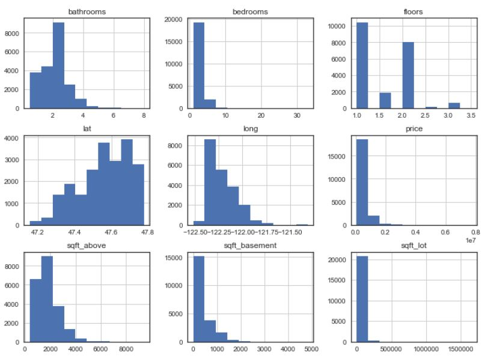
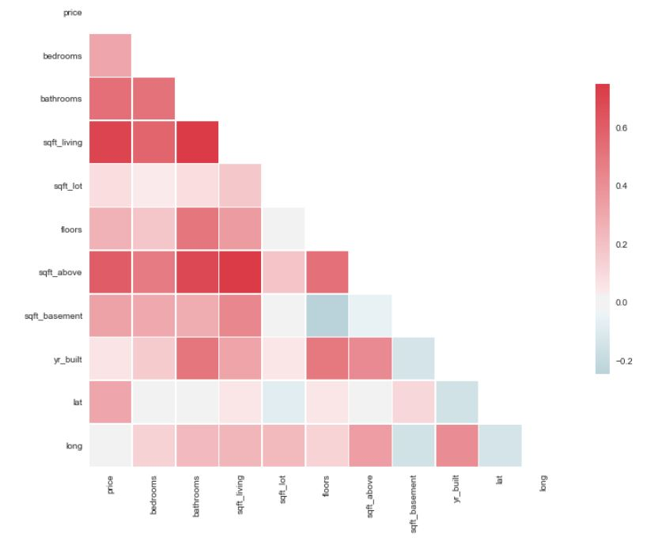
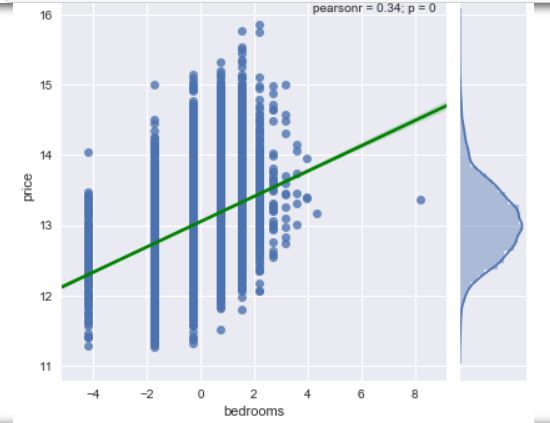
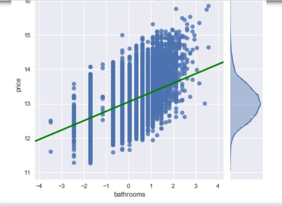

# Module 1 Final Project - King County Housing Data Modeling

This is the first module project for Flatiron School's Intensive Data Science Program. Students are asked to analyze the King County Housing dataset available on [kaggle](https://www.kaggle.com/shivachandel/kc-house-data).
Project requirements are as followed:

  __1.__ A well-document Jupyter notebook with at least 4 visualizations and 3 posed questions.
  
  __2.__ A blog post about the project or some aspect of the project ([link](https://thiennguyen.blog/2019/03/14/feature-selection-in-data-analysis/))
  
  __3.__ A presentation to be verbally delivered to the instructor

  
For more information, please see the instructions.md file

## Table of Contents

- instructions.md - txt file detailing complete instructions for data science students
- kc_house_data.csv - dataset for the project
- presentation.pdf - slideshow used for presentation
- student - detailed notebook 

## Methodology

Using a traditional OSEMN approach that data was first scrubbed and then checked for skewness and kurtosis:

Afterwards, multicollinear was examined through the use of seaborn's heatmap function:

Further exploratory data analysis with seaborn's distplot also indicated that factors like the number of bedrooms and bathrooms obviously positively correlated with price.

The final model is shown below:

![model]{images/model.JPG)

With an R-squared of .74, the model did reasonably well in predicting house prices. However, the large categorical group of zip codes was omitted from the final model due to a huge increase in dimensionality as demonstrated by 
k-fold cross validation.

## Key Findings

- Any grade 9 or lower had a detrimental impact on the housing price. A grade of 13 had the biggest positive impact on price. 
- A view of 4 had the highest impact on price out of the views, but it is unclear if more views were necessarily better. The original dataset did not elaborate on what each view meant specifically
- Condition somewhat led to high prices, but not as much as the grade received from the county grading system.
- Increases in bedrooms actually have a negative impact on price, but since the coefficient is small, this suggest that there may be an optimum amount of bedrooms to have.
- Sqft lot interestingly also has a negative relationship with price. One reasoning is that perhaps houses built on a big lot tend to be further away from the city center, which actually drives down prices. 
- Latitude and sqft above also have a moderate positive relationship with price. This suggest that the north part of the county tends to have more expensive housing. The latter is logical as living space (apart from basement) is a huge consideration in price. 
- Bathrooms don't seem to impact price much at all, even though there is a slight positive relationship. Again, this suggest there is an optimum number of bathrooms for most people.
